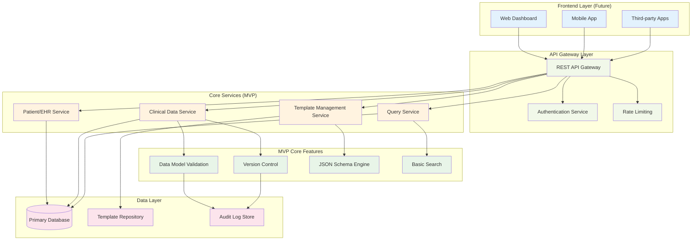

Core MVP Features
1. Clinical Data Model Engine
Priority: CRITICAL
- Basic archetype/template system (simplified version)
- JSON-based clinical data models instead of ADL initially
- Runtime model validation
- Version control for data models
2. REST API Foundation
Priority: CRITICAL
- Patient/EHR management endpoints
- Clinical data CRUD operations
- Basic query interface
- Standard HTTP methods with JSON payloads
3. Data Storage Layer
Priority: CRITICAL
- Document-oriented database (MongoDB/PostgreSQL with JSONB)
- Patient-centric data organization
- Basic versioning of clinical records
- ACID transaction support
4. Authentication & Authorization
Priority: HIGH
- JWT-based authentication
- Role-based access control (Admin, Clinician, Read-only)
- Basic audit logging

