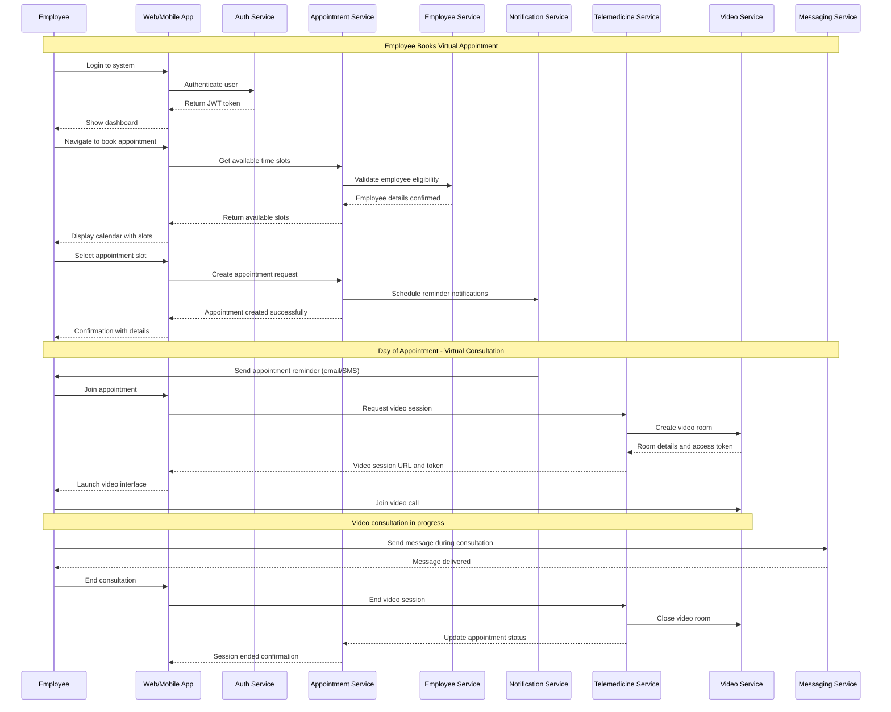
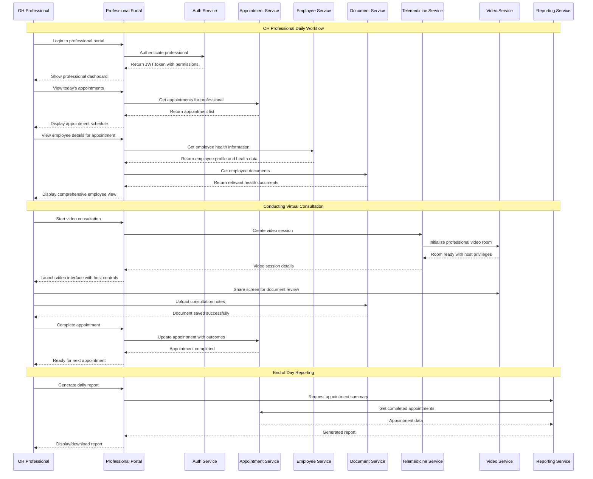
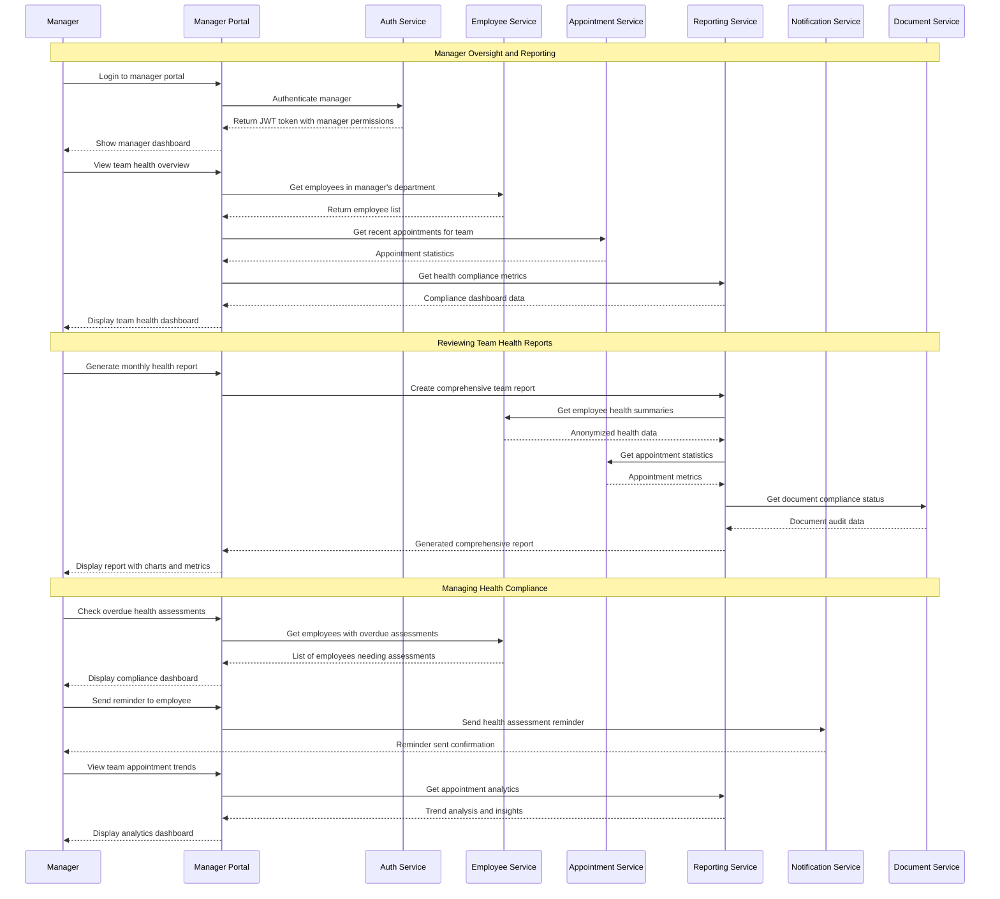
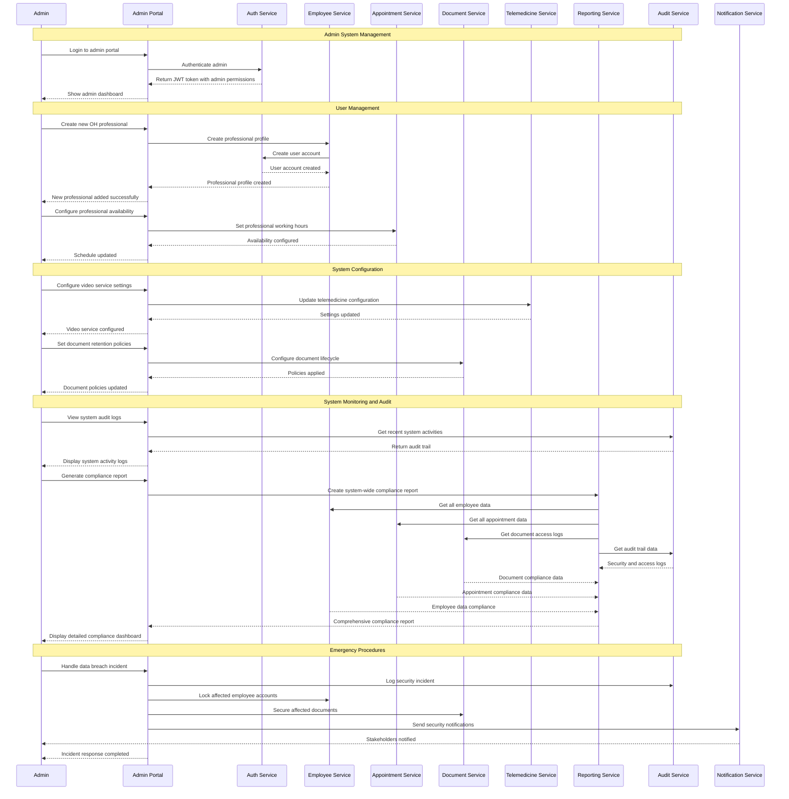
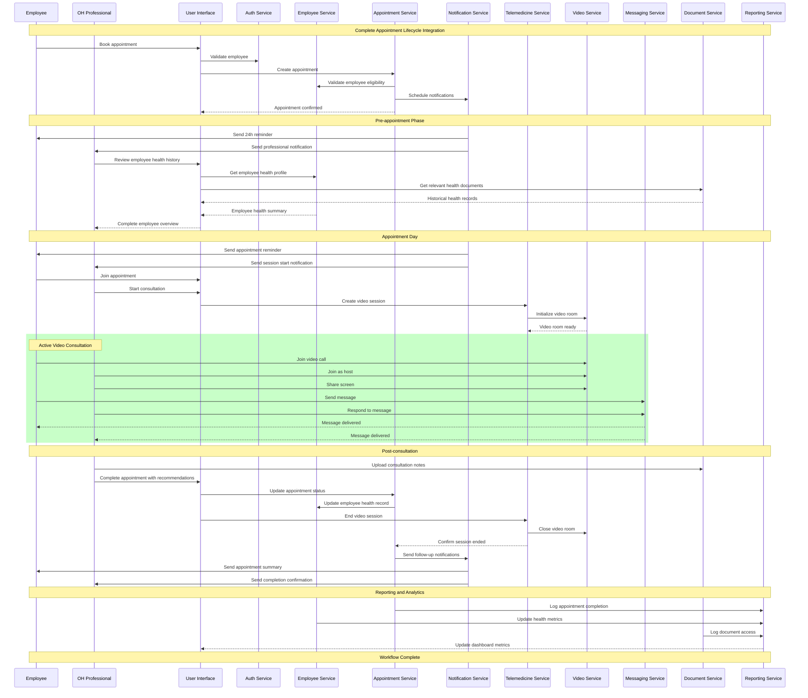

#Sequence Diagrams

```mermaid
%% Employee User Journey - Book and Attend Virtual Appointment
sequenceDiagram
    participant E as Employee
    participant UI as Web/Mobile App
    participant Auth as Auth Service
    participant AS as Appointment Service
    participant ES as Employee Service
    participant NS as Notification Service
    participant TS as Telemedicine Service
    participant VS as Video Service
    participant MS as Messaging Service

    Note over E, MS: Employee Books Virtual Appointment
    
    E->>UI: Login to system
    UI->>Auth: Authenticate user
    Auth-->>UI: Return JWT token
    UI-->>E: Show dashboard

    E->>UI: Navigate to book appointment
    UI->>AS: Get available time slots
    AS->>ES: Validate employee eligibility
    ES-->>AS: Employee details confirmed
    AS-->>UI: Return available slots
    UI-->>E: Display calendar with slots

    E->>UI: Select appointment slot
    UI->>AS: Create appointment request
    AS->>NS: Schedule reminder notifications
    AS-->>UI: Appointment created successfully
    UI-->>E: Confirmation with details

    Note over E, MS: Day of Appointment - Virtual Consultation
    
    NS->>E: Send appointment reminder (email/SMS)
    E->>UI: Join appointment
    UI->>TS: Request video session
    TS->>VS: Create video room
    VS-->>TS: Room details and access token
    TS-->>UI: Video session URL and token
    UI-->>E: Launch video interface

    E->>VS: Join video call
    Note over E, VS: Video consultation in progress
    
    E->>MS: Send message during consultation
    MS-->>E: Message delivered
    
    E->>UI: End consultation
    UI->>TS: End video session
    TS->>VS: Close video room
    TS-->>AS: Update appointment status
    AS-->>UI: Session ended confirmation
```

```mermaid
%% OH Professional User Journey - Manage Appointments and Consultations
sequenceDiagram
    participant P as OH Professional
    participant UI as Professional Portal
    participant Auth as Auth Service
    participant AS as Appointment Service
    participant ES as Employee Service
    participant DS as Document Service
    participant TS as Telemedicine Service
    participant VS as Video Service
    participant RS as Reporting Service

    Note over P, RS: OH Professional Daily Workflow
    
    P->>UI: Login to professional portal
    UI->>Auth: Authenticate professional
    Auth-->>UI: Return JWT token with permissions
    UI-->>P: Show professional dashboard

    P->>UI: View today's appointments
    UI->>AS: Get appointments for professional
    AS-->>UI: Return appointment list
    UI-->>P: Display appointment schedule

    P->>UI: View employee details for appointment
    UI->>ES: Get employee health information
    ES-->>UI: Return employee profile and health data
    UI->>DS: Get employee documents
    DS-->>UI: Return relevant health documents
    UI-->>P: Display comprehensive employee view

    Note over P, RS: Conducting Virtual Consultation
    
    P->>UI: Start video consultation
    UI->>TS: Create video session
    TS->>VS: Initialize professional video room
    VS-->>TS: Room ready with host privileges
    TS-->>UI: Video session details
    UI-->>P: Launch video interface with host controls

    P->>VS: Share screen for document review
    P->>DS: Upload consultation notes
    DS-->>P: Document saved successfully
    
    P->>UI: Complete appointment
    UI->>AS: Update appointment with outcomes
    AS-->>UI: Appointment completed
    UI-->>P: Ready for next appointment

    Note over P, RS: End of Day Reporting
    
    P->>UI: Generate daily report
    UI->>RS: Request appointment summary
    RS->>AS: Get completed appointments
    AS-->>RS: Appointment data
    RS-->>UI: Generated report
    UI-->>P: Display/download report
```

```mermaid
%% Manager User Journey - Monitor Team Health and Reports
sequenceDiagram
    participant M as Manager
    participant UI as Manager Portal
    participant Auth as Auth Service
    participant ES as Employee Service
    participant AS as Appointment Service
    participant RS as Reporting Service
    participant NS as Notification Service
    participant DS as Document Service

    Note over M, DS: Manager Oversight and Reporting
    
    M->>UI: Login to manager portal
    UI->>Auth: Authenticate manager
    Auth-->>UI: Return JWT token with manager permissions
    UI-->>M: Show manager dashboard

    M->>UI: View team health overview
    UI->>ES: Get employees in manager's department
    ES-->>UI: Return employee list
    UI->>AS: Get recent appointments for team
    AS-->>UI: Appointment statistics
    UI->>RS: Get health compliance metrics
    RS-->>UI: Compliance dashboard data
    UI-->>M: Display team health dashboard

    Note over M, DS: Reviewing Team Health Reports
    
    M->>UI: Generate monthly health report
    UI->>RS: Create comprehensive team report
    RS->>ES: Get employee health summaries
    ES-->>RS: Anonymized health data
    RS->>AS: Get appointment statistics
    AS-->>RS: Appointment metrics
    RS->>DS: Get document compliance status
    DS-->>RS: Document audit data
    RS-->>UI: Generated comprehensive report
    UI-->>M: Display report with charts and metrics

    Note over M, DS: Managing Health Compliance
    
    M->>UI: Check overdue health assessments
    UI->>ES: Get employees with overdue assessments
    ES-->>UI: List of employees needing assessments
    UI-->>M: Display compliance dashboard

    M->>UI: Send reminder to employee
    UI->>NS: Send health assessment reminder
    NS-->>M: Reminder sent confirmation
    
    M->>UI: View team appointment trends
    UI->>RS: Get appointment analytics
    RS-->>UI: Trend analysis and insights
    UI-->>M: Display analytics dashboard
```

```mermaid
%% Admin User Journey - System Management and Configuration
sequenceDiagram
    participant A as Admin
    participant UI as Admin Portal
    participant Auth as Auth Service
    participant ES as Employee Service
    participant AS as Appointment Service
    participant DS as Document Service
    participant TS as Telemedicine Service
    participant RS as Reporting Service
    participant Audit as Audit Service
    participant NS as Notification Service

    Note over A, Audit: Admin System Management
    
    A->>UI: Login to admin portal
    UI->>Auth: Authenticate admin
    Auth-->>UI: Return JWT token with admin permissions
    UI-->>A: Show admin dashboard

    Note over A, Audit: User Management
    
    A->>UI: Create new OH professional
    UI->>ES: Create professional profile
    ES->>Auth: Create user account
    Auth-->>ES: User account created
    ES-->>UI: Professional profile created
    UI-->>A: New professional added successfully

    A->>UI: Configure professional availability
    UI->>AS: Set professional working hours
    AS-->>UI: Availability configured
    UI-->>A: Schedule updated

    Note over A, Audit: System Configuration
    
    A->>UI: Configure video service settings
    UI->>TS: Update telemedicine configuration
    TS-->>UI: Settings updated
    UI-->>A: Video service configured

    A->>UI: Set document retention policies
    UI->>DS: Configure document lifecycle
    DS-->>UI: Policies applied
    UI-->>A: Document policies updated

    Note over A, Audit: System Monitoring and Audit
    
    A->>UI: View system audit logs
    UI->>Audit: Get recent system activities
    Audit-->>UI: Return audit trail
    UI-->>A: Display system activity logs

    A->>UI: Generate compliance report
    UI->>RS: Create system-wide compliance report
    RS->>ES: Get all employee data
    RS->>AS: Get all appointment data
    RS->>DS: Get document access logs
    RS->>Audit: Get audit trail data
    Audit-->>RS: Security and access logs
    DS-->>RS: Document compliance data
    AS-->>RS: Appointment compliance data
    ES-->>RS: Employee data compliance
    RS-->>UI: Comprehensive compliance report
    UI-->>A: Display detailed compliance dashboard

    Note over A, Audit: Emergency Procedures
    
    A->>UI: Handle data breach incident
    UI->>Audit: Log security incident
    UI->>ES: Lock affected employee accounts
    UI->>DS: Secure affected documents
    UI->>NS: Send security notifications
    NS-->>A: Stakeholders notified
    UI-->>A: Incident response completed
```

```mermaid
%% Cross-Service Integration Flow - Complete Appointment Lifecycle
sequenceDiagram
    participant E as Employee
    participant P as OH Professional
    participant UI as User Interface
    participant Auth as Auth Service
    participant ES as Employee Service
    participant AS as Appointment Service
    participant NS as Notification Service
    participant TS as Telemedicine Service
    participant VS as Video Service
    participant MS as Messaging Service
    participant DS as Document Service
    participant RS as Reporting Service

    Note over E, RS: Complete Appointment Lifecycle Integration

    E->>UI: Book appointment
    UI->>Auth: Validate employee
    UI->>AS: Create appointment
    AS->>ES: Validate employee eligibility
    AS->>NS: Schedule notifications
    AS-->>UI: Appointment confirmed

    Note over E, RS: Pre-appointment Phase
    
    NS->>E: Send 24h reminder
    NS->>P: Send professional notification
    
    P->>UI: Review employee health history
    UI->>ES: Get employee health profile
    UI->>DS: Get relevant health documents
    DS-->>UI: Historical health records
    ES-->>UI: Employee health summary
    UI-->>P: Complete employee overview

    Note over E, RS: Appointment Day
    
    NS->>E: Send appointment reminder
    NS->>P: Send session start notification
    
    E->>UI: Join appointment
    P->>UI: Start consultation
    UI->>TS: Create video session
    TS->>VS: Initialize video room
    VS-->>TS: Video room ready
    
    rect rgb(200, 255, 200)
        Note over E, P: Active Video Consultation
        E->>VS: Join video call
        P->>VS: Join as host
        P->>VS: Share screen
        E->>MS: Send message
        P->>MS: Respond to message
        MS-->>E: Message delivered
        MS-->>P: Message delivered
    end

    Note over E, RS: Post-consultation
    
    P->>DS: Upload consultation notes
    P->>UI: Complete appointment with recommendations
    UI->>AS: Update appointment status
    AS->>ES: Update employee health record
    
    UI->>TS: End video session
    TS->>VS: Close video room
    TS-->>AS: Confirm session ended
    
    AS->>NS: Send follow-up notifications
    NS->>E: Send appointment summary
    NS->>P: Send completion confirmation

    Note over E, RS: Reporting and Analytics
    
    AS->>RS: Log appointment completion
    ES->>RS: Update health metrics
    DS->>RS: Log document access
    RS-->>UI: Update dashboard metrics
    
    Note over E, RS: Workflow Complete
```